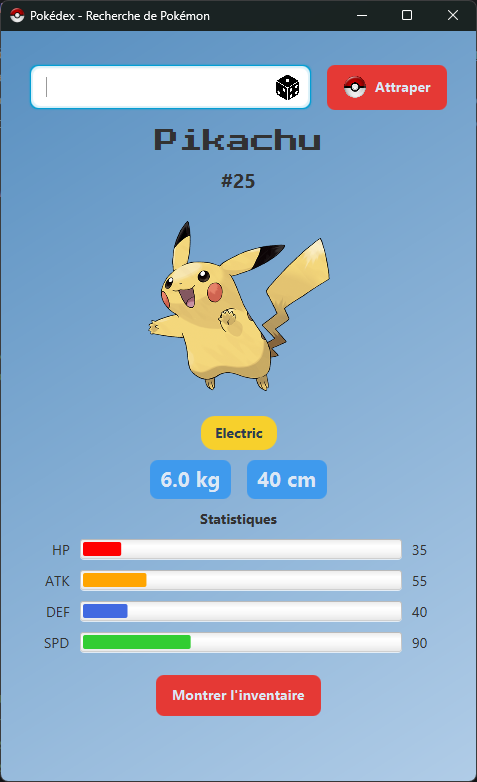
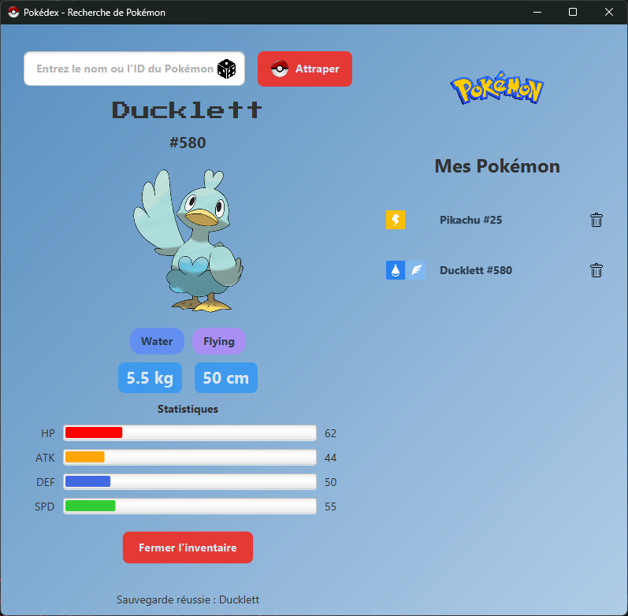

# POKEHACK - TP 1 - EVA - MAD






## INITIALISATION

1. Clonez le dépôt GitHub sur votre machine locale (https://github.com/evabessette/Pokehack).
2. Créez une base de données PostgreSQL nommée "pokehack".
3. Exécutez le script `database/schema.sql` pour créer les tables nécessaires.
4. Créez un fichier `config.properties` dans `src/main/resources` avec vos informations de connexion (ex: config.properties.example).
5. Allez dans Run > Edit configurations..., then under Application > MainFx: Modify options > Add VM options, et coller `--module-path "insert-your-path-here\javafx-sdk-26.0.1\lib" --add-modules javafx.controls,javafx.media` dedans.


## STRUCTURE DU PROJET
```
├── README.md
├── pom.xml
└── src
    └── main
        ├── java
        │   └── pokehack
        │       ├── Main.java
        │       ├── MainFx.java
        │       ├── TestApi.java
        │       ├── controller
        │       │   └── PokemonController.java
        │       ├── modele
        │       │   ├── Pokemon.java
        │       │   └── PokemonDAO.java
        │       ├── service
        │       │   └── PokemonApiService.java
        │       ├── utils
        │       │   ├── Config.java
        │       │   └── Connexion.java
        │       └── view
        │           └── PokemonViewFx.java
        └── resources
            ├── config.properties.exemple
            ├── fonts
            │   ├── OFL.txt
            │   └── PressStart2P-Regular.ttf
            ├── images
            │   ├── capture.gif
            │   ├── capture_3.png
            │   ├── capture_4.png
            │   ├── dice.png
            │   ├── pokeball.png
            │   ├── pokemon.png
            │   └── trash.png
            ├── schema.sql
            └── style.css
```

## DATABASE

```
id, nom, image_url, type_principal, type_principal_icon, type_principal_name,
type_secondaire, type_secondaire_icon, type_secondaire_name, hp, attaque,
defense, attaque_spéciale, defense_spéciale,
vitesse, poids, taille, date_capture
```

L'utilisateur doit créer une base de données PostgreSQL avec le nom "pokehack" 
et il doit ensuite adapter le fichier de connexion à la base de données en modifiant
ses informations de connexion.

## SOURCES
https://github.com/evabessette/Pokehack

https://pokedex-examen-mi-session.vercel.app/

https://pokeapi.co/api/v2/pokemon

https://youtu.be/0-pysHuJ4Jg

<a href="https://www.flaticon.com/free-icons/dice" title="dice icons">Dice icon created by bearicons - Flaticon</a>
